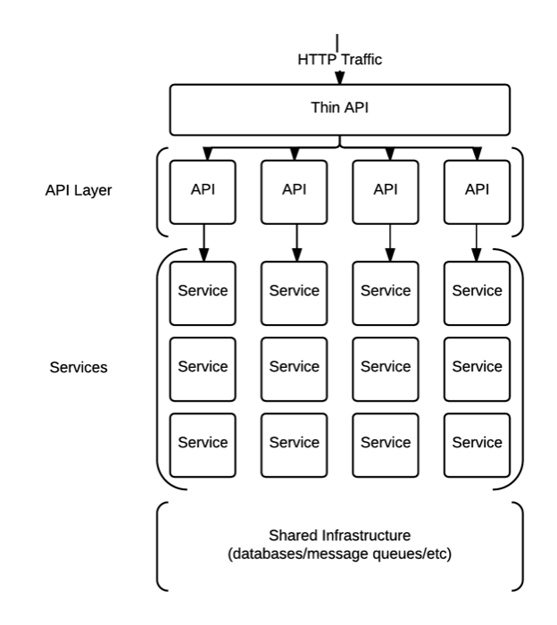

# Getting Started

This page should help you get started when developing a new service, there are a number of ways that you can work with the Hailo platform but here we will try go over the easiest ways.

To start off with if you have not got anything installed check out the following [instructions](./installation.md). It is also worth checking that you have all the correct accounts and credentials [setup](./setup-credentials.md).

## Before we start...

Before you start creating your first service it is worth having a basic idea of what is going on.

All services are running on Amazon EC2 instances, these instances are setup automatically using various automation tools (such as Puppet). The services are deployed using our custom tooling and a release does not require SSHing onto a server or running a script on your laptop.

These services communicate between themselves using RPC over a message queue called RabbitMQ, these messages are encoded as Protocol buffers which means even the messages we send are typed. The use of a message queue allows us to do some useful routing and load balancing but this is abstracted away and your service will just just handle inbound requests and return a response.

Since these services and RabbitMQ are all hidden from the outside world we need a way to access the platform, this is achieved by the Thin API, this is very similar to the other services but instead of receiving requests from RabbitMQ it uses HTTP. However since our services talk using Protocol buffers we need some way of converting the HTTP requests and responses to Protocol buffers, to do this we use "api services".

For more information check out the [architecture](../architecture) section which covers the entire H2 stack in much more detail.

## Creating your first service

Now that you hopefully have a basic idea of what a H2 service is and you have your development environment setup if is time to create your first service. To help you we have a number of templates:
 - [h2o-go-template](https://github.com/HailoOSS/h2o-go-template): To be used in most cases, creates a service which talks over RabbitMQ using Protocol buffers.
 - [h2o-go-api-template](https://github.com/HailoOSS/h2o-go-template): To be used when creating an "api service", receives Protocol buffer messages from the Thin API representing the HTTP [request](https://github.com/HailoOSS/api-hailo-2/blob/master/proto/api/api.proto#L3) and response with a message representing the HTTP [response](https://github.com/HailoOSS/api-hailo-2/blob/master/proto/api/api.proto#L17).

Now you are ready to start writing some code! Check out the [services](../services) section to read about how to use the shared libraries to build your service.
